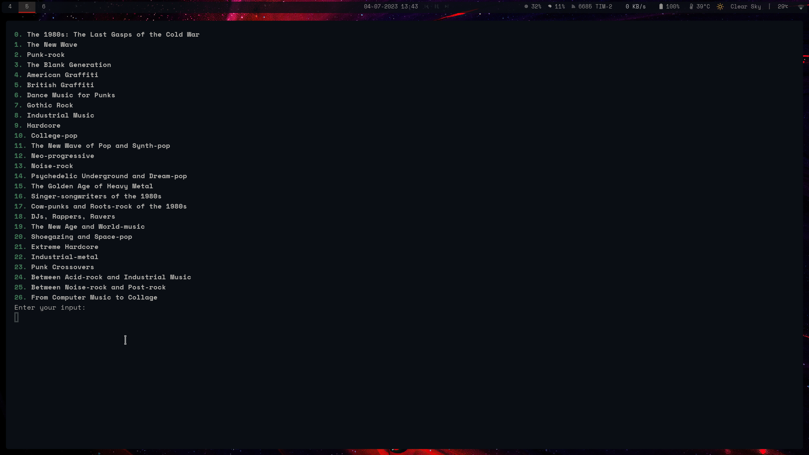
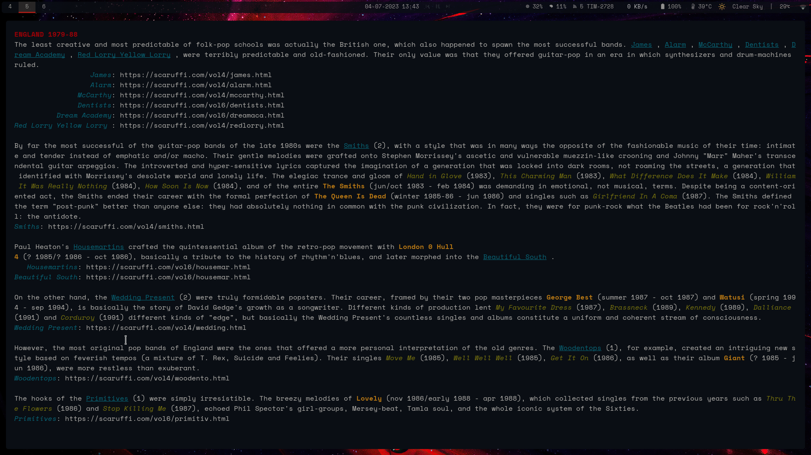

# scaruffi_tui

Web scraper to get [Scaruffi's](https://scaruffi.com/history/long.html) History of music on your terminal.

## Installation

Clone the repository. Then use `lein` to run, or build it with GraalVM's native
image:

```shell

export ENABLE_ANSI_COLORS=t

lein do clean

lein uberjar

lein native

```

## Usage

Use `lein run` or build it and use `scaruffi_tui`

## To do

- Trim and clean artist page text

## Screenshots




